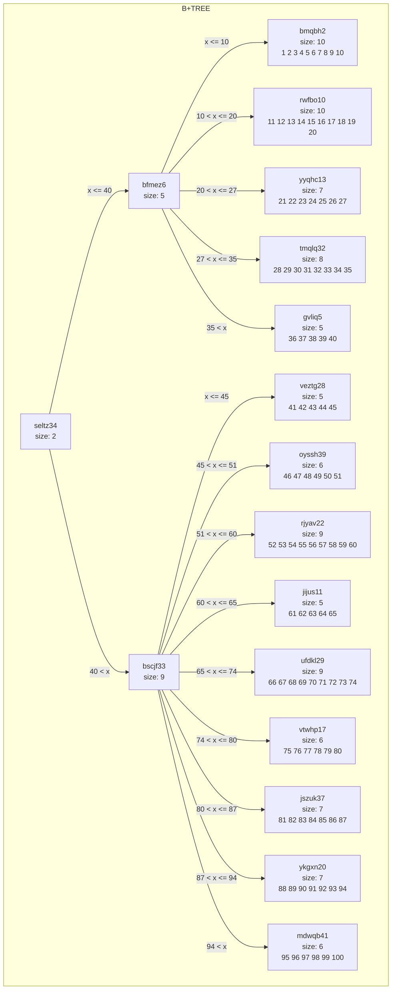

```mermaid
graph TD
subgraph B+TREE
seltz34[seltz34<br/>size: 2<br/>]
bfmez6[bfmez6<br/>size: 5<br/>]
bmqbh2[bmqbh2<br/>size: 10<br/>1 2 3 4 5 6 7 8 9 10 ]
bfmez6-->|x <= 10|bmqbh2
rwfbo10[rwfbo10<br/>size: 10<br/>11 12 13 14 15 16 17 18 19 20 ]
bfmez6-->|10 < x <= 20|rwfbo10
yyqhc13[yyqhc13<br/>size: 7<br/>21 22 23 24 25 26 27 ]
bfmez6-->|20 < x <= 27|yyqhc13
tmqlq32[tmqlq32<br/>size: 8<br/>28 29 30 31 32 33 34 35 ]
bfmez6-->|27 < x <= 35|tmqlq32
gvliq5[gvliq5<br/>size: 5<br/>36 37 38 39 40 ]
bfmez6-->|35 < x|gvliq5
seltz34-->|x <= 40|bfmez6
bscjf33[bscjf33<br/>size: 9<br/>]
veztg28[veztg28<br/>size: 5<br/>41 42 43 44 45 ]
bscjf33-->|x <= 45|veztg28
oyssh39[oyssh39<br/>size: 6<br/>46 47 48 49 50 51 ]
bscjf33-->|45 < x <= 51|oyssh39
rjyav22[rjyav22<br/>size: 9<br/>52 53 54 55 56 57 58 59 60 ]
bscjf33-->|51 < x <= 60|rjyav22
jijus11[jijus11<br/>size: 5<br/>61 62 63 64 65 ]
bscjf33-->|60 < x <= 65|jijus11
ufdkl29[ufdkl29<br/>size: 9<br/>66 67 68 69 70 71 72 73 74 ]
bscjf33-->|65 < x <= 74|ufdkl29
vtwhp17[vtwhp17<br/>size: 6<br/>75 76 77 78 79 80 ]
bscjf33-->|74 < x <= 80|vtwhp17
jszuk37[jszuk37<br/>size: 7<br/>81 82 83 84 85 86 87 ]
bscjf33-->|80 < x <= 87|jszuk37
ykgxn20[ykgxn20<br/>size: 7<br/>88 89 90 91 92 93 94 ]
bscjf33-->|87 < x <= 94|ykgxn20
mdwqb41[mdwqb41<br/>size: 6<br/>95 96 97 98 99 100 ]
bscjf33-->|94 < x|mdwqb41
seltz34-->|40 < x|bscjf33
end
```

```mermaid
graph LR
subgraph UNORDERED_HEAP
nwlrb1[nwlrb1<br/>size: 4<br/>60 35 2 63 ]
sqcyz3[sqcyz3<br/>size: 4<br/>58 46 27 44 ]
nwlrb1-->sqcyz3
esiqc4[esiqc4<br/>size: 4<br/>19 10 88 53 ]
sqcyz3-->esiqc4
imjee7[imjee7<br/>size: 4<br/>6 99 64 32 ]
esiqc4-->imjee7
augua8[augua8<br/>size: 4<br/>97 21 4 1 ]
imjee7-->augua8
omqsn9[omqsn9<br/>size: 4<br/>14 69 28 83 ]
augua8-->omqsn9
byzne12[byzne12<br/>size: 4<br/>30 18 20 12 ]
omqsn9-->byzne12
wjxdd14[wjxdd14<br/>size: 4<br/>56 38 74 73 ]
byzne12-->wjxdd14
zrsrl15[zrsrl15<br/>size: 4<br/>85 24 3 5 ]
wjxdd14-->zrsrl15
fihkm16[fihkm16<br/>size: 4<br/>100 40 51 91 ]
zrsrl15-->fihkm16
okpny18[okpny18<br/>size: 4<br/>8 72 13 54 ]
fihkm16-->okpny18
vnwnv19[vnwnv19<br/>size: 4<br/>86 93 78 87 ]
okpny18-->vnwnv19
kwgcn21[kwgcn21<br/>size: 4<br/>89 52 57 80 ]
vnwnv19-->kwgcn21
kxoge23[kxoge23<br/>size: 4<br/>55 79 23 15 ]
kwgcn21-->kxoge23
fwpxj24[fwpxj24<br/>size: 4<br/>17 50 9 65 ]
kxoge23-->fwpxj24
psyli25[psyli25<br/>size: 4<br/>33 71 66 39 ]
fwpxj24-->psyli25
vlscj26[vlscj26<br/>size: 4<br/>62 84 45 37 ]
psyli25-->vlscj26
fmhnq27[fmhnq27<br/>size: 4<br/>41 7 36 61 ]
vlscj26-->fmhnq27
krjbq30[krjbq30<br/>size: 4<br/>43 94 29 70 ]
fmhnq27-->krjbq30
sqlqd31[sqlqd31<br/>size: 4<br/>96 26 47 59 ]
krjbq30-->sqlqd31
rpewz35[rpewz35<br/>size: 4<br/>68 82 34 75 ]
sqlqd31-->rpewz35
pgsyj36[pgsyj36<br/>size: 4<br/>49 77 98 81 ]
rpewz35-->pgsyj36
enyxa38[enyxa38<br/>size: 4<br/>48 42 22 76 ]
pgsyj36-->enyxa38
zmnkf40[zmnkf40<br/>size: 4<br/>16 31 25 95 ]
enyxa38-->zmnkf40
vhiqh42[vhiqh42<br/>size: 4<br/>67 90 11 92 ]
zmnkf40-->vhiqh42
end
```
