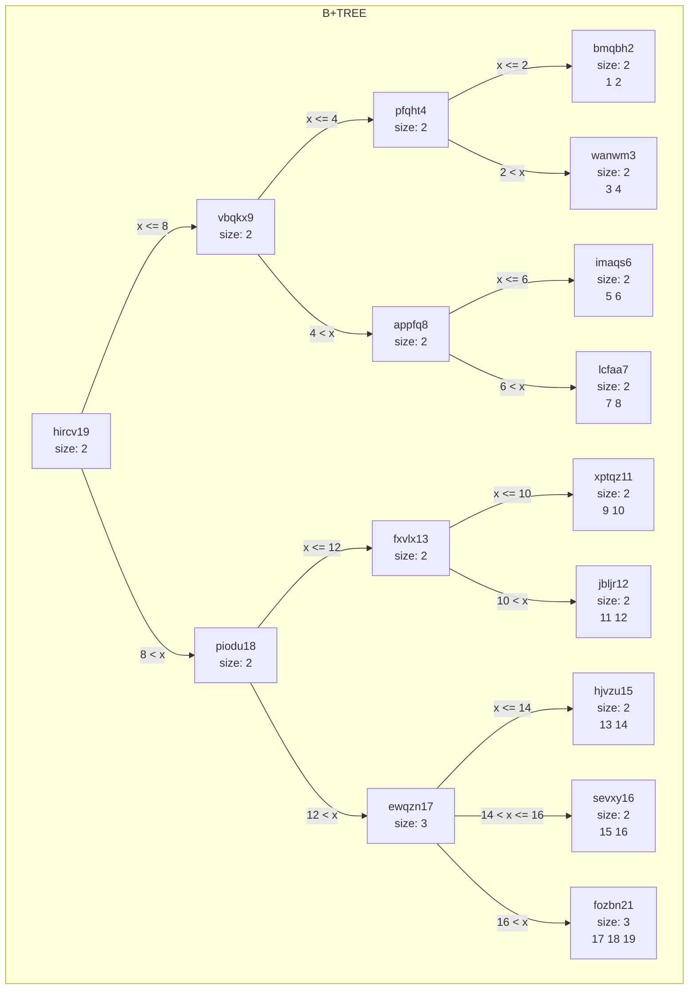
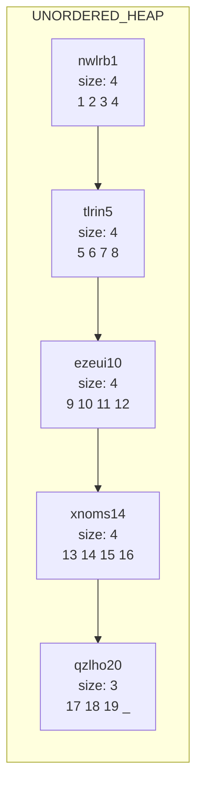

```mermaid
graph TD
subgraph B+TREE
hircv19[hircv19<br/>size: 2<br/>]
vbqkx9[vbqkx9<br/>size: 2<br/>]
pfqht4[pfqht4<br/>size: 2<br/>]
bmqbh2[bmqbh2<br/>size: 2<br/>1 2 ]
pfqht4-->|x <= 2|bmqbh2
wanwm3[wanwm3<br/>size: 2<br/>3 4 ]
pfqht4-->|2 < x|wanwm3
vbqkx9-->|x <= 4|pfqht4
appfq8[appfq8<br/>size: 2<br/>]
imaqs6[imaqs6<br/>size: 2<br/>5 6 ]
appfq8-->|x <= 6|imaqs6
lcfaa7[lcfaa7<br/>size: 2<br/>7 8 ]
appfq8-->|6 < x|lcfaa7
vbqkx9-->|4 < x|appfq8
hircv19-->|x <= 8|vbqkx9
piodu18[piodu18<br/>size: 2<br/>]
fxvlx13[fxvlx13<br/>size: 2<br/>]
xptqz11[xptqz11<br/>size: 2<br/>9 10 ]
fxvlx13-->|x <= 10|xptqz11
jbljr12[jbljr12<br/>size: 2<br/>11 12 ]
fxvlx13-->|10 < x|jbljr12
piodu18-->|x <= 12|fxvlx13
ewqzn17[ewqzn17<br/>size: 3<br/>]
hjvzu15[hjvzu15<br/>size: 2<br/>13 14 ]
ewqzn17-->|x <= 14|hjvzu15
sevxy16[sevxy16<br/>size: 2<br/>15 16 ]
ewqzn17-->|14 < x <= 16|sevxy16
fozbn21[fozbn21<br/>size: 3<br/>17 18 19 ]
ewqzn17-->|16 < x|fozbn21
piodu18-->|12 < x|ewqzn17
hircv19-->|8 < x|piodu18
end
```

```mermaid
graph LR
subgraph UNORDERED_HEAP
nwlrb1[nwlrb1<br/>size: 4<br/>1 2 3 4 ]
tlrin5[tlrin5<br/>size: 4<br/>5 6 7 8 ]
nwlrb1-->tlrin5
ezeui10[ezeui10<br/>size: 4<br/>9 10 11 12 ]
tlrin5-->ezeui10
xnoms14[xnoms14<br/>size: 4<br/>13 14 15 16 ]
ezeui10-->xnoms14
qzlho20[qzlho20<br/>size: 3<br/>17 18 19 _ ]
xnoms14-->qzlho20
end
```
