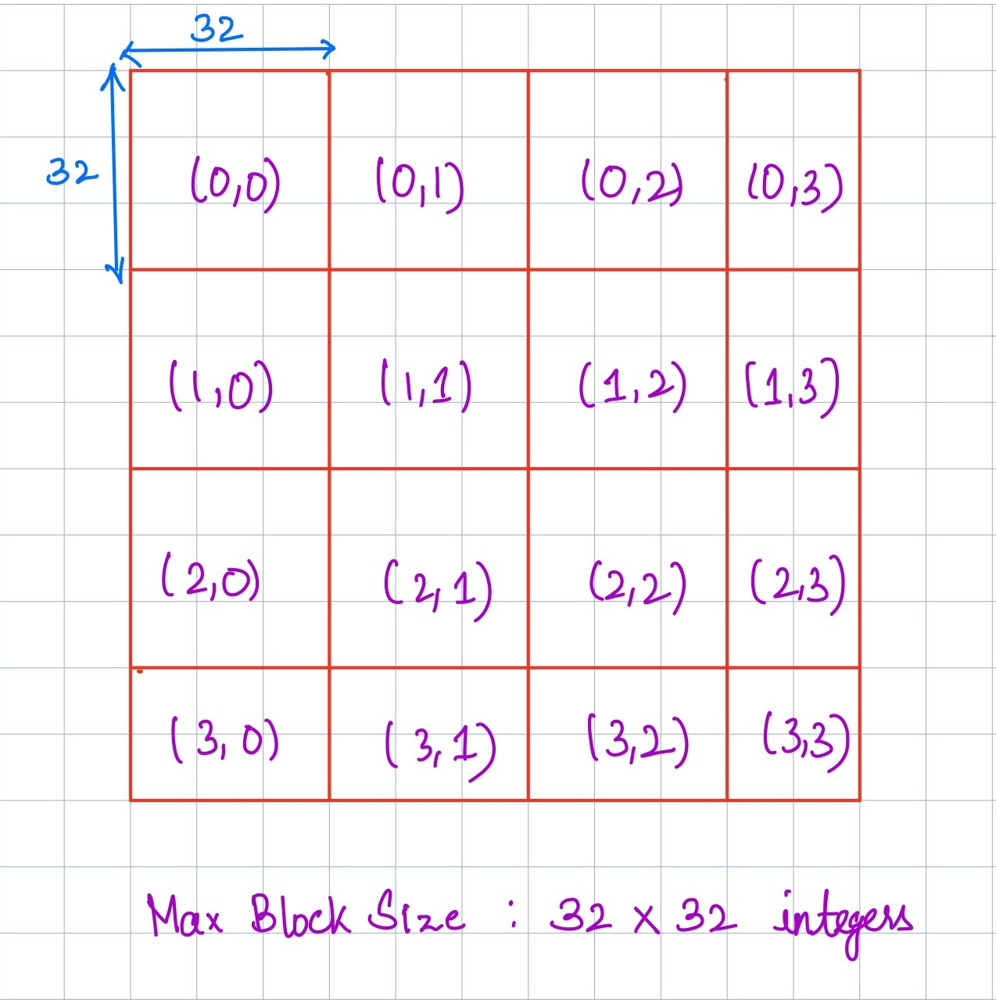

# matrix

# Part 1

### Page Layout to Store the Matrices

**Fig1: Page Layout** 

Every block can hold utmost $32 \times 32$  integers. For matrices of size greater than 32 in any dimension, the entire matrix is divided into blocks of $32 \times 32$ and stored as `**<MatrixName>**_Page**<i>**_**<j>`** where every matrix is stored with a multi-dimensional array indexing where the vertical axis is numbered with `i` and the horizontal with `j`. ****If a sub-matrix does not contain 32 elements in any dimension, the block is stored as-is. 

The matrices are read block wise across the length of the document and only the first 32 elements are processed each time. Hence the pages are created across the length of the document i.e proceeds along the `j` axis first and then at the end starts again at `i+1,0`.  

# Part 2

### In-Place Cross-Transpose Operation

**Idea:** We carry out the Cross-transpose operation by the sub-matrix method. For example, consider the following matrix:

$$

\left[\begin{array}{ccc|c}
  1 & 2 & 3 & 4 & 5\\
6 & 7 & 8 & 9 & 10\\
11 & 12 & 13 & 14 & 15\\
  \hline
  16 & 17 & 18 & 19 & 20\\
21 & 22 & 23 & 24 & 25\\
\end{array}\right]

$$

Let us label the ith block from the left and jth block from top  as $B_{ij}$ . We can observe that we can obtain the transpose of the above matrix by filling in the transpose of $B_{ij}$ in $B_{ji}$.

$$

\left[\begin{array}{ccc|c}
  1 & 6 & 11 & 16 & 21\\
2 & 7 & 12 & 17 & 22\\
3 & 8 & 13 & 18 & 23\\
  \hline
 4 & 9 & 14 & 19 & 24\\
5 & 10 & 15 & 20 & 25\\
\end{array}\right]

$$

For In-place Cross-Transpose Operation, 

- **Obtain the relevant blocks:** We obtain the block $B_{ij}$ (`**Matrix1**_Page**i**_**j**`) from Matrix1 into vector of vectors page1 and block $B_{ji}$ (`**Matrix1**_Page**i**_**j**`) from Matrix2 into vector of vectors page2 . Note that if page1 is of dimension $M\times N$, then page2 has a dimension $N\times M$.
- **Swap and Transpose in Main Memory**: We then store transposed page1 in a main memory variable, temp, and the transposed page2 in page1. We then store temp into page2.
- **Write into Page:** We write page1 into `**Matrix1**_Page**i**_**j`** and page2 into **`Matrix1**_Page**i**_**j**`
- Export both the matrices using the function `makepermanent()` implemented in part **2.4**.

# Part 3

This task involves supporting sparse matrices in the design of the database system. We describe the design in 3 parts:

- Page Layout
- Load and Exporting the Matrix.
- Implementation of Cross Transpose

### Page Layout

Every sparse matrix can be represented as a list 3-tuple of the format: `(i,j,k)` where `i` and `j` are the 2 dimensional array indices of the sparse matrix and `k` is the non-zero value at position `(i,j)`. Hence, every sparse matrix can be compressed to a list of 3-tuples that contain values that are non-zero. However care needs to be taken of the page layout required to store these tuples since basic matrix operations such as load,export and cross-transpose still needs to be performed efficiently.

The Page Layout proposed is complemented by an indexing system that helps promote the efficiency of the operations required by preventing multiple accesses to pages for every element processed. The indexing of the pages is a map between sub-matrices of the sparse matrix and the corresponding disk blocks stored. 

**Page Layout:** Let us consider a page size of $32 \times 32$ integers where the matrix is parsed **sub-matrix** wise as described above over the length of the document. During the parse, as non-zero elements are encountered they are appended to a list that are finally written to a **block** whenever it reaches the maximum number of 3-tuples that can be stored in a **block.** There are two major rules on creating the blocks:

- Each **block** should contain all non-zero elements of integral number of **sub-matrices**. If for any block a **sub-matrix** is not able to insert all its non-zero elements, we create a new **block** and store it there. For example, if the **block** contains the non-zero elements from **sub-matrix(0,0)**, it must contain all the non-zero elements of **sub-matrix(0,0).**
- A block contains elements only from the vertical parse of the file. That is the blocks are stored and cleared from main memory whenever the **EOF** is reached for every **submatrix width.**

**Index File:**

The following index file is created while loading the matrix:

`Sub-Matrix Index:` The sparse matrix is indexed just like any matrix as described above. Each of the $32 \times 32$  sub-matrices has an index of the form `(i,j)`. Fig 1 explains the indexing used.

`Block/Page Index:` This index is an integer that starts from `0` and is incremented once a block exhausts its limit of 3-tuples.

`Start Pointer:` Since the block is capable of storing a non-spare $32 \times32$ it can be safely assumed that the number of sub-matrices stored in a matrix ≥ 1. Hence, `Start Pointer` indicates the index within the block where a particular sub-matrix starts.

`End Pointer:` `End Pointer` denotes the index within the block where a particular sub-matrix ends.

### Load and Exporting the Matrix:

**Load:** The matrix is parsed along the length of the matrix reading the first 32 integers of each line. Initialize the properties of the index file for a sub-matrix `(i,j)`. As the sub-matrix finishes check if it can fill the current block `k`. If yes, fill the current block from the `s` index to `t` index with the 3-tuples of the current sub-matrix. Fill the index with `(i,j): k,s,t`. If it doesn’t fill start a new block and fill the index correspondingly. If a sub-matrix has no non-zero entry the index is filled with `-1s`.

**Export:** Since we export a matrix in its sparse form, we need to re-generate the matrix with the help of the page layout and the index. Going row-wise, we know the sub-matrices that need to be accessed. Given the `(i,j)` sub-matrix that needs to be accessed, find its corresponding Block/Page Index and generate that part of the row based on the contents of the block between the `Start` and `End` indices (obtained from index file).

### Transpose:

Given a sparse matrix A, Transpose is implemented with the following steps:

- We first access its index files from stable storage. We have now obtained a map to the latent sub-matrix structure and aim to fall back to the method designed for non-sparse matrices.
- Now let us consider a sub-matrix `(i,j)` of a matrix say `A`.  Let us create a copy of the index file of `A` to be stored at the last. In the copied index, modify the entry for the key `(j,i)` to the entry of `(i,j)`. This is because the `(i,j)` sub-matrix transforms into `(j,i)` sub-matrix after transpose. We shall design the method in such a way that the `Page Index`, the `Start Pointer` and the `End Pointer` do not change.
- Now access the specific region of the sub-matrix using the address in the index files and replace every 3-tuple of the format `(s,t,v)` , where `s,t` denotes the index and `v` denotes the value, into `(t,s,v)`. Now perform an in-place sort in the region, sorting the tuples first by its first element and then by its second. This preserves the order of insertion in that region.
- Similarly process all the sub-matrices of  the matrices.
